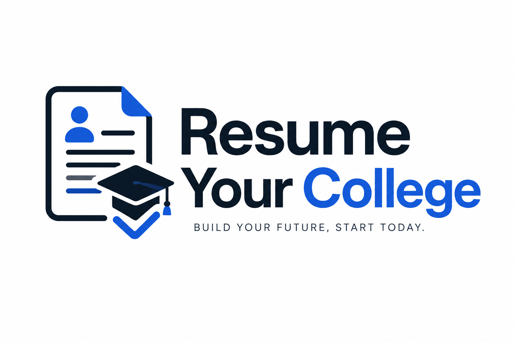

An AI-powered Resume Builder that helps students create ATS-friendly resumes, optimize them using AI, manage multiple resume versions, and prepare for placements with a modern developer experience.
All project documentation lives in the [documentation hub](docs/readme.md).

Start with the [developer quick start](docs/development/setup.md) and [application architecture](docs/architecture/overview.md).
