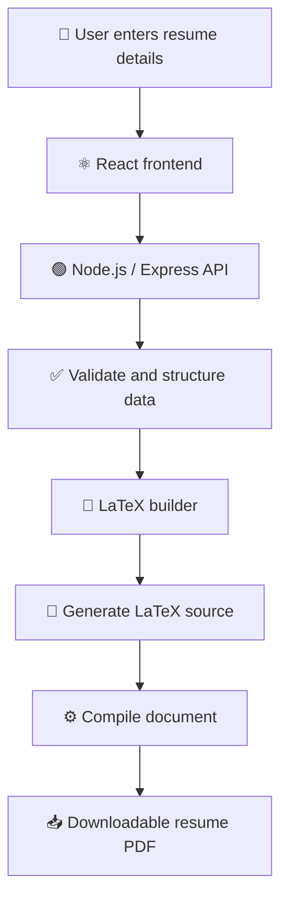

# 🚀 AI Resume Builder

  

<h3 align="center">Build smarter resumes. Stand out with confidence.</h3>

  An AI-powered resume builder that helps students create professional, ATS-friendly resumes using a LaTeX-based document generation engine, with AI-assisted resume creation on the roadmap.

  
  
  
  
  

  <a href="docs/readme.md">📚 Documentation</a> ·
  <a href="docs/development/setup.md">⚙️ Quick Start</a> ·
  <a href="docs/architecture/overview.md">🏗️ Architecture</a>

---

## ✨ Overview

**AI Resume Builder** is a web application designed to make resume creation easier for students and job seekers.

It combines a React-based frontend with a Node.js and Express.js backend and a custom **LaTeX builder** that transforms structured resume information into professionally formatted PDF documents.

The vision extends beyond templates: AI-assisted resume generation, content improvement, ATS-conscious formatting, and role-specific resume management.

## 🎯 Key Features

| Feature | Description |
|---|---|
| 📝 Structured Resume Builder | Organize education, experience, projects, skills, and achievements. |
| 📄 LaTeX-to-PDF Generation | Convert structured resume data into LaTeX and compile it into a PDF. |
| 🤖 AI Resume Generation | Planned assistance for creating resume content from user-provided details. |
| 🎯 ATS-Friendly Formatting | Focus on readable layouts and structured resume sections. |
| 🗂️ Multiple Resume Versions | Designed to support different resumes for different roles. |
| 💡 AI Resume Optimization | Planned suggestions for stronger bullet points and job-specific content. |

> **Development status:** Features marked as planned or in development may not yet be available in the current release.

## 🛠️ Tech Stack

  
  
  
  
  
  

## ⚙️ How It Works

```mermaid
flowchart TD
    A["👤 User enters resume details"] --> B["⚛️ React frontend"]
    B --> C["🟢 Node.js / Express API"]
    C --> D["✅ Validate and structure data"]
    D --> E["📝 LaTeX builder"]
    E --> F["📄 Generate LaTeX source"]
    F --> G["⚙️ Compile document"]
    G --> H["📥 Downloadable resume PDF"]
```

### 📄 The LaTeX Builder

The LaTeX builder is the core document-generation component. It converts structured information and formatted strings into LaTeX source code, then compiles the document into a PDF.

**Generation pipeline:**

1. 📥 Receive structured resume data.
2. 🔄 Convert values into LaTeX-compatible content.
3. 🧩 Assemble the content into a resume template.
4. ⚙️ Compile the LaTeX document.
5. 📄 Return the generated PDF to the user.

**Security consideration:** User input must be safely escaped before insertion into LaTeX source. Compilation should run in a restricted environment to prevent malicious input from executing commands or accessing server resources.

## 🤖 AI-Powered Resume Generation

The project is being extended with AI-assisted resume creation, with the goal of helping users turn their existing information into structured, professional resume content.

Planned capabilities include:

- ✍️ Generate resume drafts from user-provided information.
- 🪄 Improve project descriptions and experience bullet points.
- 📊 Highlight measurable outcomes and relevant skills.
- 🎯 Tailor content to specific job descriptions.
- 🔍 Suggest improvements and identify missing information.

AI-generated content should remain grounded in the user's actual experience, without inventing skills, qualifications, or achievements.

## 📚 Documentation

All project documentation lives in the documentation hub.

| Resource | Description |
|---|---|
| 📚 [Documentation Hub](docs/readme.md) | Main entry point for project documentation. |
| ⚡ [Developer Quick Start](docs/development/setup.md) | Set up the project locally. |
| 🏗️ [Application Architecture](docs/architecture/overview.md) | Understand the system design and components. |

## 🚀 Getting Started

Start with the [Developer Quick Start](docs/development/setup.md) for the exact installation instructions.

The general setup process includes:

1. 📥 Clone the repository.
2. 📦 Install frontend and backend dependencies.
3. 🔐 Configure the required environment variables.
4. 📝 Install and configure the required LaTeX compiler.
5. ▶️ Start the frontend and backend servers.

Refer to the setup documentation for the actual commands, environment variables, and runtime requirements.

## 🗺️ Roadmap

- [x] ⚛️ React-based user interface
- [x] 🟢 Node.js and Express.js backend foundation
- [x] 📝 LaTeX-based resume generation pipeline
- [x] 🤖 AI-powered resume generation
## 🌐 Future Features
- [ ] 🎯 AI-assisted resume optimization
- [ ] 🗂️ Resume version management
- [ ] 🔍 Job-description-based resume tailoring
- [ ] 📊 Resume quality insights

> Update the checkboxes to reflect the features that are actually implemented and tested in your repository.

## 🤝 Contributing

Contributions, suggestions, and bug reports are welcome.

Before making significant changes, review the [Application Architecture](docs/architecture/overview.md) and follow the [Developer Quick Start](docs/development/setup.md).

## 📜 License

A license has not yet been specified. Add a `LICENSE` file and update this section when the project license is selected.

---

  <strong>💻 Built for students. Designed for better opportunities.</strong>

